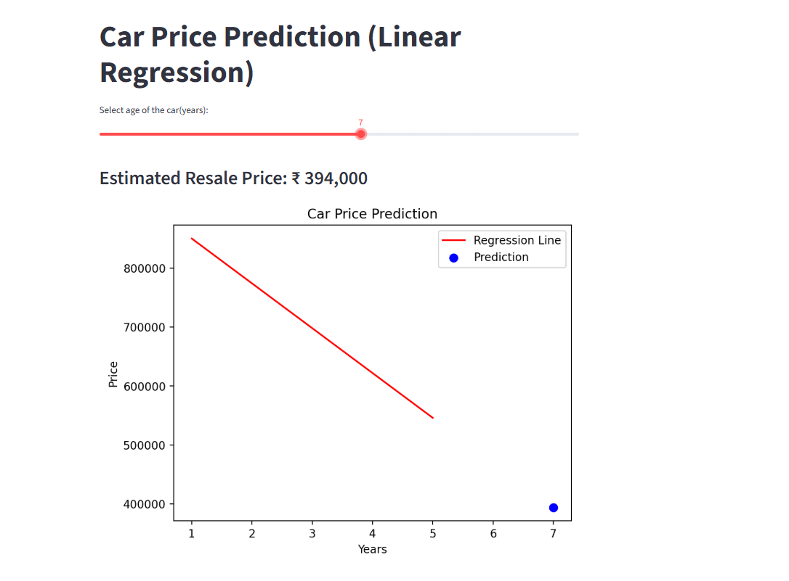

# 🚗 Simple Linear Regression – Car Price Prediction

## 📌 About the Project
- This project predicts the **resale price of a car** based on its **age** using **Simple Linear Regression**.
- It uses the **`carprice.csv`** dataset containing car ages and corresponding prices.
- Implemented in **Python** with libraries:
  - pandas → Data handling
  - scikit-learn → Model training
  - matplotlib → Data visualization
- The model finds the **best-fit line** to understand the relationship between car age and resale price.
- Useful for:
  - Basic machine learning learning purposes
  - Understanding regression concepts
  - Quick demonstration of prediction models

## 📈 Workflow
1. Load dataset (`carprice.csv`)
2. Visualize data using matplotlib
3. Train a Simple Linear Regression model
4. Predict resale price for a given car age
5. Display regression line on a plot
